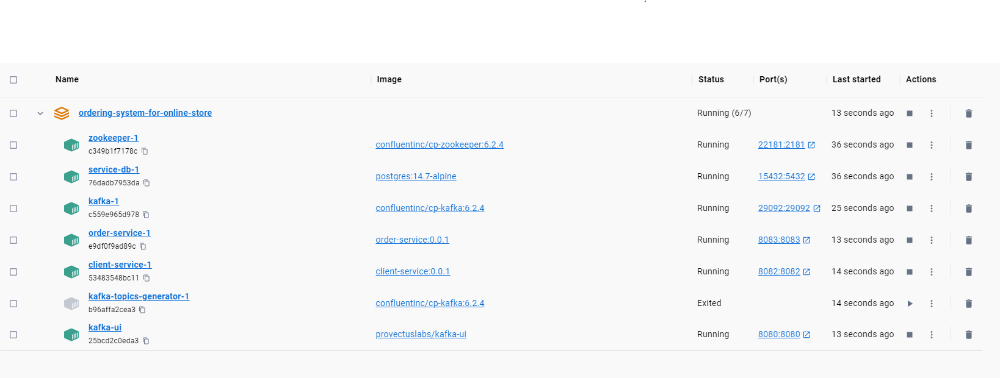

Проект: Система заказов для интернет-магазина.

Запуск проекта: **docker-compose up -d**

   

При закуске контейнера с базой данных PostgresQL происходит автоматическое создание базы данных. Таблицы в базу данных создаются с помощью liquibase.

Возможности приложения.
1. **Создание, редактирование, поиск Клиента (сущность Client).**

Скрипт для создания Клиента:

{
"firstName": "Ivan",
"lastName": "Ivanovich",
"address": "Minsk",
"email": "ivan_2000@mail.com",
"telephone": "+375291234567"
} 

**Приложение может:**
- создать Клиента;
- редактировать Клиента;
- найти Клиента по id;
- найти всех Клиентов.

2. **Создание, редактирование, поиск Заказа (сущность Order).**

Скрипт для создания Заказа:

{
"clientId": 1,
"description": "Apple MacBook Air 2022 г., 512GB SSD M2 8CPU 24GB Midnight",
"orderStatus": "IN_PROGRESS"
}  

**Приложение может:**
- создать Заказ. Если Клиент с таким id не существует, то тогда происходит создание Клиента со следующим по порядку id и с нулевыми значениями. Данная взаимосвязь между order-service микросервисом и client-service микросервисом организована через брокер сообщений Kafka. Когда происходит сохранение Заказа в topic kafka отправляется сообщение об этом с id Заказа и id Клиента, который сделал этот заказ. После идет проверка существует ли Клиент с данным id, если его нет, то тогда он создается с нулевыми значениями (которые позже можно редактировать) и через RestTemplate идет обращение к микросервису order-service c сохраненным id Клиента и id Заказа, и в данном Заказе обновляется id Клиента на правильный.
- получить все Заказы;
- обновить Заказ;
- получить Заказ по id;
- обновить Статус Заказа, передавая в url id Заказа и его новый Статус;
- получить все Заказы Клиента по id Клиента, если передать также Статус, то будут отображены все Заказы данного Клиента с данным Статусом.

**Улучшение приложения:**
- каждый микросервис должен иметь отдельную базу данных и соответственно переделать получение всех Заказов Клиента;
- валидация данных на корректность передаваемых значений;
- добавление документации к приложению (swagger);
- 100% покрытие тестами уровней сервисов client-service и order-service;
- замена отправки id Заказа и id сохраненного Клиента в order-service c RestTemplate на брокер сообщений kafka для большей надежности и производительности.

